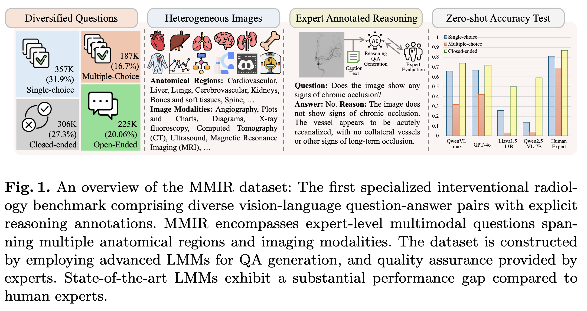

# MMIR: Reasoning-Enhanced Massive Multimodal Benchmark for Interventional Radiology

The MMIR dataset consists of approximately 184K high-quality medical images spanning multiple imaging modalities with 1.2M meticulously generated question-answer pairs across various anatomical regions. To facilitate comparative evaluation against human experts, we establish a specialized MMIR-tiny subset containing 1,000 carefully selected Q\&As equally dstributed into 4 types. 

This repo aims at making the data public-available. 

